# Neural Network Visualization With Latex (tikz)

All the code are from Internet. Thanks all the people who contribute to this project.

**Demo 1**

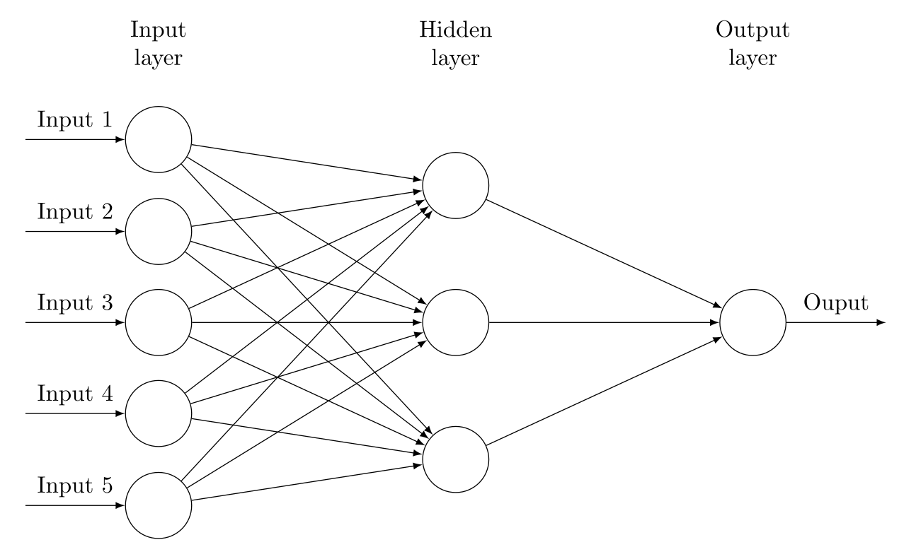

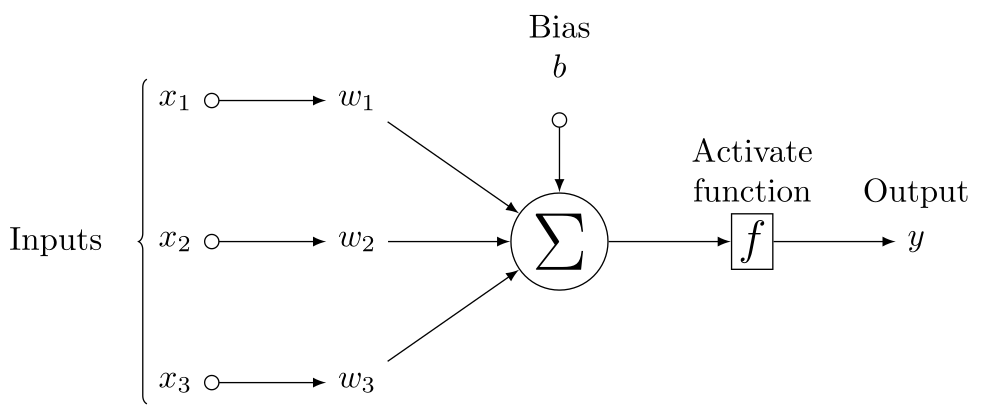

**Demo 2**

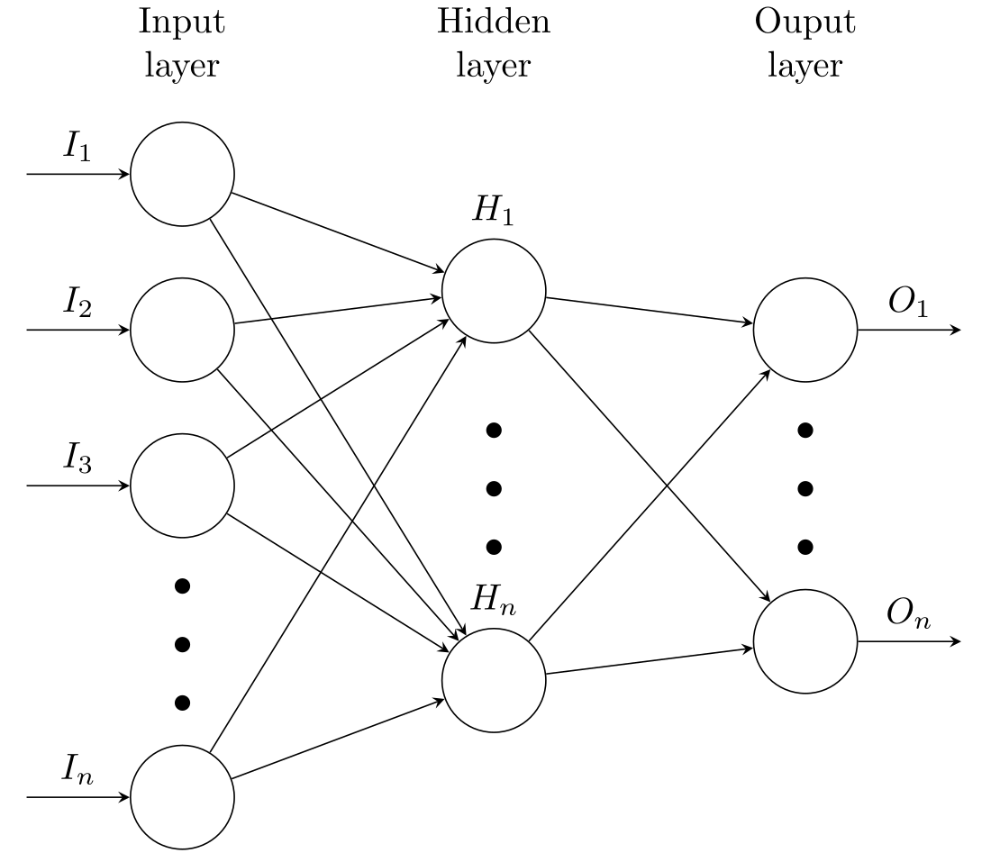

**Demo 3**

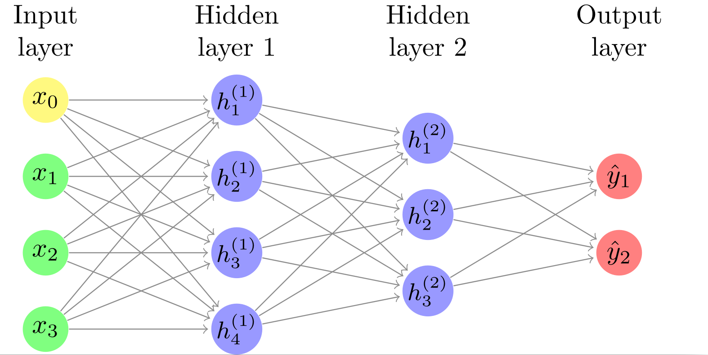

**Demo 4**

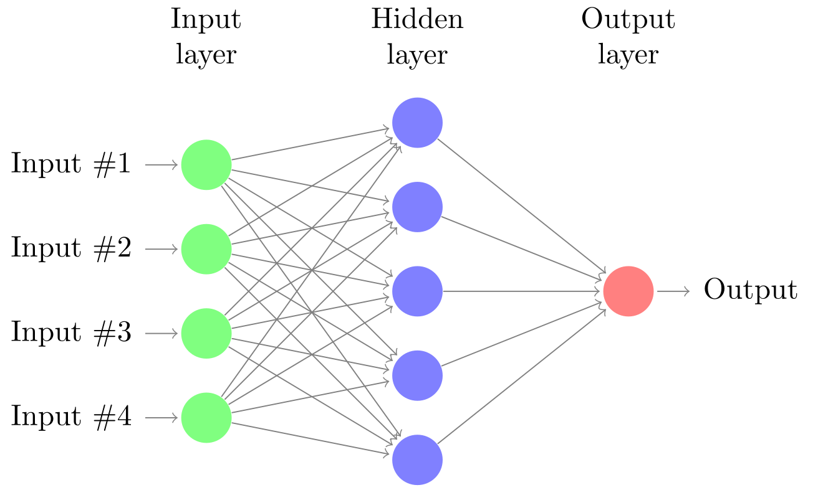

**Demo 5**

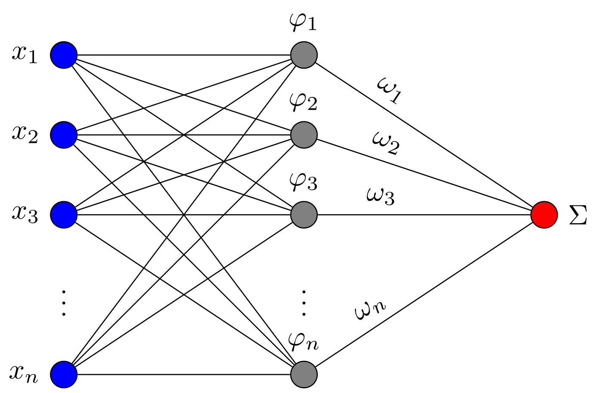

**Demo 6**

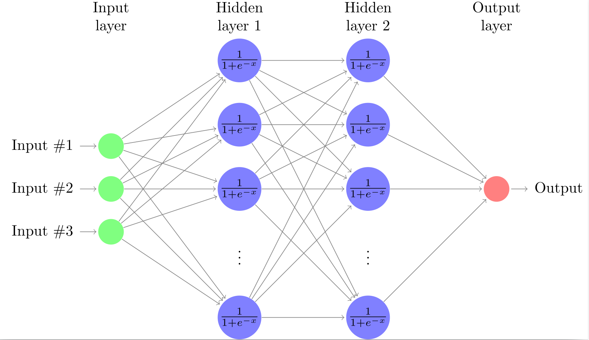

**Demo 7**

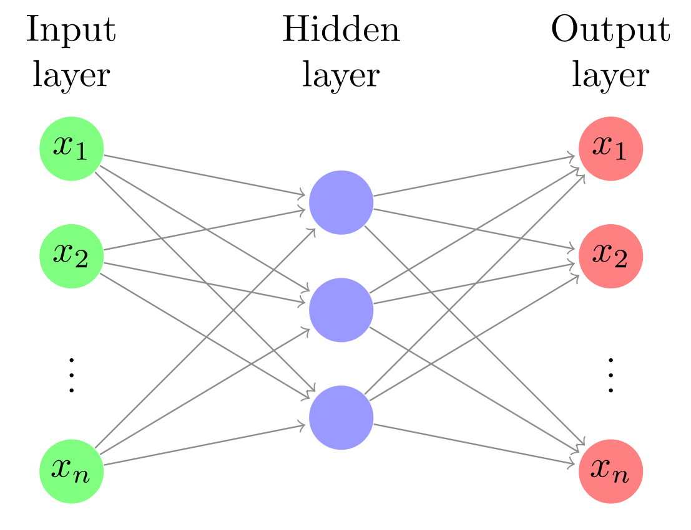

**Demo 8**

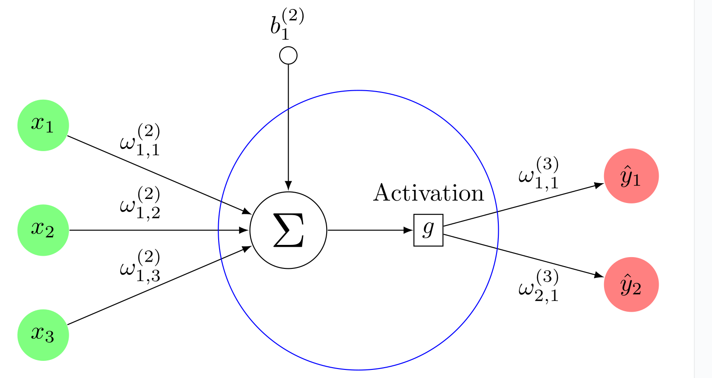

**Demo 9**

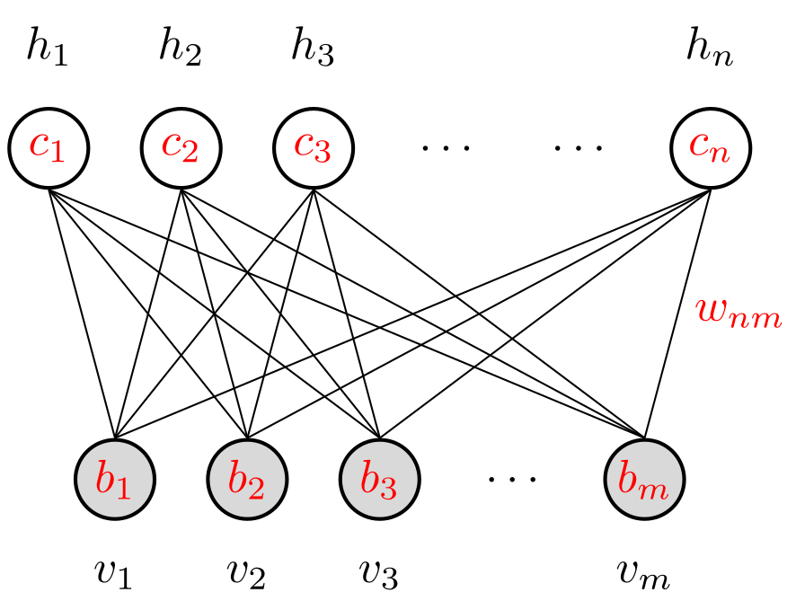

**Demo 10**

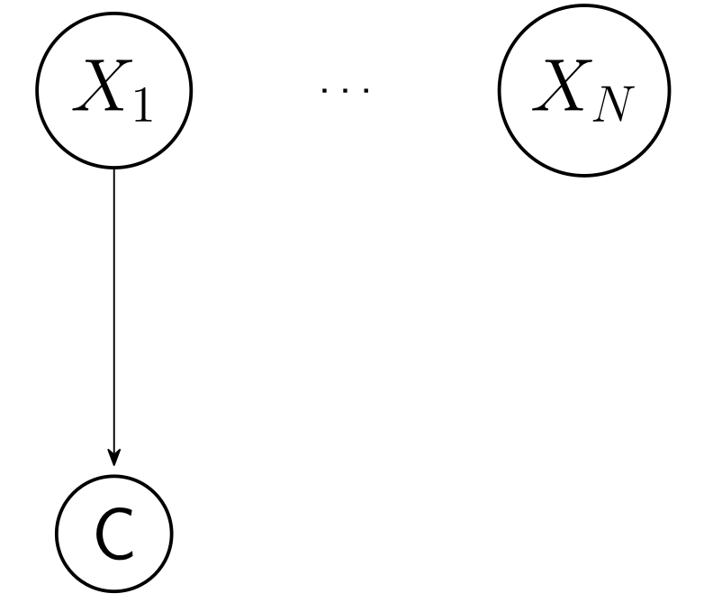

**Demo 11**

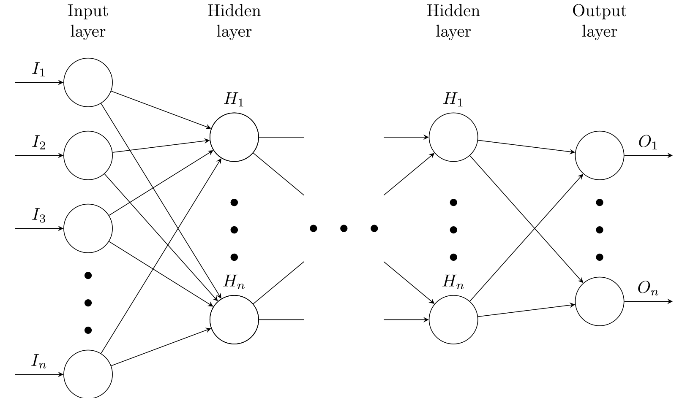

